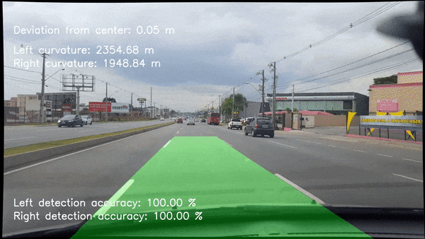

# Curitiba Self Driving Car #

This project is dedicated to implement an Autonomous Driving Car in the city of Curitiba, Brazil.

## Lane Detection
***

One important step for the self driving car is to locate and keep track of road lanes. For this purpose I prepared a code using a series of techniques for lane detection on videoshots made using a simple cellphone camera.

## Requirements ##
***
* Python 3.6
* OpenCV 3.4.2
* MatplotLib 3.1.0
* Moviepy 0.2.3.5

## Usage ##
***

On the **lane_detector** folder you have three folders with images for camera calibration (camera_cal), test shots (test_imagse) and videos (videos). You can follow the step-by-step the notebook **lane_detection.ipynb** for the processing pipeline that executes the following steps:
* Camera calibration
* Binary Map
* Lane Search 
* Calculate Curvature
* Plot detected lane on original image

